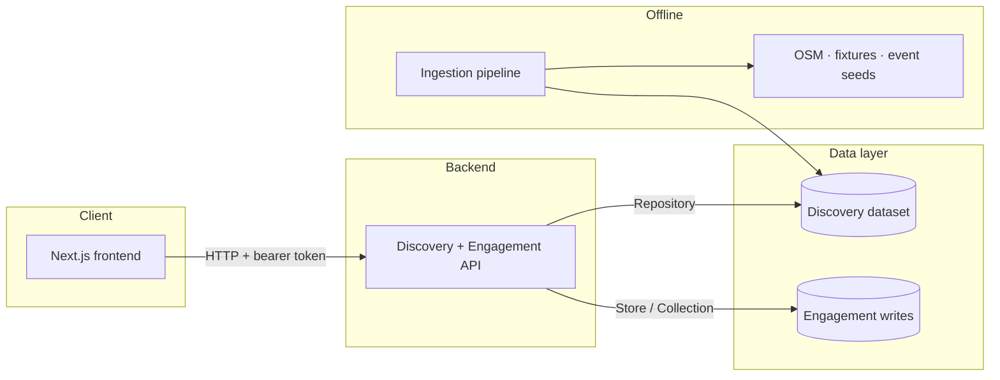
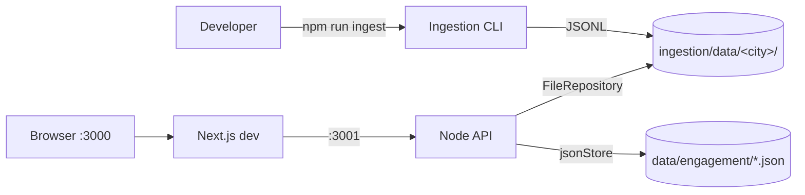
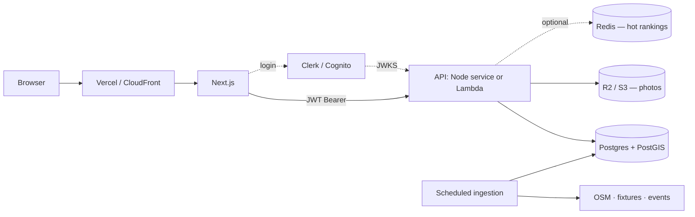
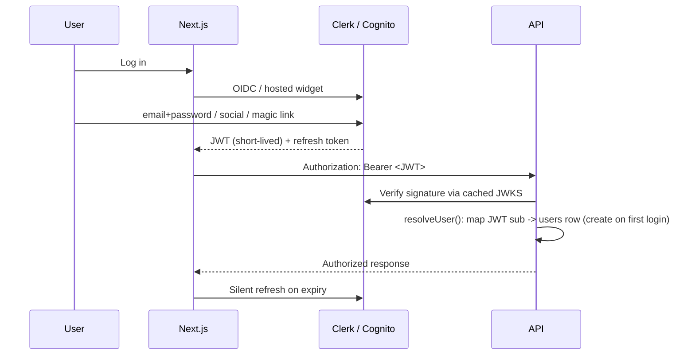

# FanWatch — Architecture

> **Status:** Living document
> **Scope:** Current implementation, the seams that make it hostable, and the
> target production architecture.
>
> Companion docs: [`PRD.md`](./PRD.md) (what & why) · [`WORKFLOW.md`](./WORKFLOW.md)
> (flow/ER diagrams). This file is the **HOW it's built and deployed**.

---

## 1. System overview

FanWatch is three independent TypeScript packages that share a canonical data
model:

| Package                     | Role                                                                                    | Entry point          | Runtime          |
| --------------------------- | --------------------------------------------------------------------------------------- | -------------------- | ---------------- |
| [`ingestion/`](./ingestion) | Phase 0 batch pipeline: scrape → normalize → geocode → dedup → enrich → score → publish | `src/cli/run.ts`     | Node CLI         |
| [`api/`](./api)             | Phase 1+ discovery + engagement API                                                     | `src/http/server.ts` | Node HTTP server |
| [`frontend/`](./frontend)   | Web app (map, list, rankings, engagement)                                               | `src/app/page.tsx`   | Next.js 14       |



The defining property of the codebase is that **storage, auth, and transport
are all behind interfaces**, so local dev uses the simplest possible
implementation and production swaps the implementation without touching feature
code.

---

## 2. The seams (why it runs locally now and hosts later)

Three abstractions are the entire migration story. Local dev satisfies them
with files/stubs; production satisfies them with managed services.

### 2.1 Read seam — `Repository`

Discovery data is read through [`Repository`](./api/src/data/repository.ts):

```ts
interface Repository {
  listCities(): Promise<string[]>;
  venues(citySlug: string): Promise<Venue[]>;
  matches(citySlug: string): Promise<Match[]>;
  events(citySlug: string): Promise<Event[]>;
}
```

- **Local:** `FileRepository` reads the JSONL the ingestion pipeline wrote to
  `ingestion/data/<city>/`.
- **Postgres/Supabase:** [`PgRepository`](./api/src/data/pgRepository.ts) reads
  the `venues` / `matches` / `events` tables that ingestion upserts. The full
  canonical object lives in a `data` jsonb column, so a row maps straight back
  to the domain type — same contract as the JSONL. Plain Postgres (no PostGIS):
  the extracted columns (`city_slug`, `kickoff`, …) exist only for filtering;
  geo-radius stays in JS, matching `FileRepository`.

The composition root selects the backend on `DATABASE_URL` and passes the repo
(and store) into `buildContainer(env, repo, store)` —
[`server.ts`](./api/src/http/server.ts) / [`container.ts`](./api/src/container.ts).

### 2.2 Write seam — `Store` / `Collection`

Engagement writes (users, reviews, check-ins, predictions, posts, photos) go
through `Store.collection<T>()`, a tiny CRUD surface
(`all` / `find` / `findOne` / `insert` / `update`). `Store` and `Collection`
are now interfaces in [`jsonStore.ts`](./api/src/store/jsonStore.ts); services
depend on the interface, never a concrete backend.

- **Local:** `JsonStore` / `JsonCollection` — full-file-rewrite JSON under
  `data/engagement/<name>.json`. Single-process only — explicitly **not** safe
  for concurrent/multi-instance.
- **Postgres/Supabase:** [`PgStore` / `PgCollection`](./api/src/store/pgStore.ts)
  store every record in a generic `engagement` table keyed by `(collection, id)`
  with the record in a `data` jsonb column. `find` / `findOne` load the
  collection's rows and filter in JS — identical semantics to the file store.
  `insert` upserts (`on conflict do update`). Services and handlers are untouched.

### 2.3 Auth seam — `AuthService.resolveUser`

[`AuthService`](./api/src/auth/auth.ts) is a **dev stub**: token is
`fmtok_<userId>`, no password/signature/expiry. The rest of the API depends
only on:

```ts
resolveUser(authHeader?: string): Promise<User | undefined>
```

- **Local:** parse the prefixed user id.
- **Production:** verify a real JWT against the IdP's JWKS and map the token
  `sub` to a local `users` row. `requireUser` and every handler stay the same.

### 2.4 Transport seam — HTTP server

[`server.ts`](./api/src/http/server.ts) maps routes to transport-agnostic
handlers (`(req) => Promise<ApiResponse>`).

- **Local:** Node `http` server.
- **Production:** keep the Node server (Render/Railway) **or** write a thin
  Lambda adapter behind API Gateway — only this one file changes.

### 2.5 Config seam — environment variables

Both [`api` env](./api/src/config/env.ts) and
[`ingestion` env](./ingestion/src/config/env.ts) read `process.env` with
zero-config local defaults. Hosting = setting env vars, not editing code:

| Var                    | Local default               | Production                |
| ---------------------- | --------------------------- | ------------------------- |
| `PORT`                 | 3001                        | platform-assigned         |
| `DATA_DIR`             | `../ingestion/data`         | unused when DB is set     |
| `DATABASE_URL`         | _(unset → local files)_     | managed Postgres/Supabase |
| `ANTHROPIC_API_KEY`    | absent → heuristic fallback | secret store              |
| `NEXT_PUBLIC_API_BASE` | `http://localhost:3001`     | API public URL            |

---

## 3. Current local architecture



**Run locally (today):**

```bash
# 1. Build the dataset (writes ingestion/data/<city>/*.jsonl)
npm --prefix ingestion run ingest -- all

# 2. Start the API (reads the dataset; port 3001)
npm --prefix api run dev

# 3. Start the frontend (port 3000)
npm --prefix frontend run dev
```

No database, no cloud account, no secrets required.

---

## 4. Target production architecture



Changes vs. local: ingestion dual-writes to **Postgres/Supabase** (the
`SupabasePublisher`, JSONL still emitted as source of truth + rollback); the API
reads venues/events from Postgres when `DATABASE_URL` is set. Geo-radius runs in
JS today (plain Postgres, no PostGIS) — moving it into SQL with PostGIS
`ST_DWithin` is a later optimization. Still ahead: JWT auth from a managed IdP
and presigned object-storage photo uploads.

---

## 5. Hosting options

### Option A — Cheapest / simplest (recommended start) — ~$0–25/mo

| Concern   | Service                          | Notes                                |
| --------- | -------------------------------- | ------------------------------------ |
| Frontend  | **Vercel**                       | Next.js native; free Hobby tier      |
| API       | **Render** / **Railway**         | Runs the current Node server as-is   |
| Database  | **Neon** / **Supabase** Postgres | Serverless, scale-to-zero, free tier |
| Auth      | **Clerk** / **Supabase Auth**    | Free to ~10k MAU                     |
| Ingestion | **GitHub Actions** cron          | No server; commits or writes to DB   |
| Photos    | **Cloudflare R2**                | No egress fees                       |

### Option B — Serverless AWS (matches `WORKFLOW.md`) — scales to zero

S3 + CloudFront · API Gateway → Lambda · Aurora Serverless v2 (PostGIS) ·
Cognito · EventBridge-scheduled ingestion. More moving parts and lock-in; pick
when traffic/cost justifies it. The seams above make A → B migration cheap.

---

## 6. Database (target)

**Shipped** ([`supabase/migrations/0001_init.sql`](./supabase/migrations/0001_init.sql)):
a portable plain-Postgres schema (no PostGIS, no DB-side uuid defaults — the app
supplies all ids) that runs identically on Supabase, a local Postgres, and a
PGlite harness. Each row carries the full canonical object in a `data` jsonb
column; extracted columns exist only for filtering.

- **Discovery (ingestion target):** `venues`, `events`, `matches`, keyed by id
  with `city_slug` / `kickoff` indexes. Radius search runs in JS for now.
- **Engagement (app writes):** a single generic `engagement` table keyed by
  `(collection, id)` — maps 1:1 from today's `Store` collections.

**Deferred:** PostGIS `GEOGRAPHY(Point)` + GiST index to push `ST_DWithin`
radius search into SQL; per-table engagement schemas if/when query patterns need
them.

Discovery does not _require_ a DB (read-only JSONL works), but engagement does
the moment there are real concurrent users — the file store corrupts under
concurrent/multi-instance writes.

---

## 7. Security & auth flow

### 7.1 Known gaps (must fix before launch)

1. **Forgeable tokens** — `fmtok_<userId>` allows trivial impersonation. _Critical._
2. **No password / MFA** — passwordless-by-trust.
3. **Input validation at API boundary** — reuse `zod` (already used in ingestion);
   note `Collection.update()` spreads arbitrary `patch` (mass-assignment risk).
4. **CORS** — lock to the frontend origin.
5. **Rate limiting** — none; add at edge/gateway.
6. **Secrets** — platform secret store only, never in repo.
7. **Photo uploads** — replace 12 MB base64-through-API with presigned uploads.

### 7.2 Login flow (target)



Implementation: `register`/`login` endpoints are removed (IdP owns them);
`resolveUser` becomes JWT verification + local profile lookup keyed by `sub`;
the frontend drops the `localStorage` token in
[`api.ts`](./frontend/src/lib/api.ts) for the IdP SDK (httpOnly session).

---

## 8. Suggested sequencing

1. ~~**Postgres** — implement `PgRepository` + `PgStore` behind the existing
   interfaces; dual-write ingestion to the DB.~~ ✅ Shipped (plain Postgres /
   Supabase; PostGIS radius search still deferred — see §6).
2. **Real auth** — JWT verification in `resolveUser` (Clerk/Cognito).
3. **Hardening** — zod validation at boundaries, CORS lockdown, rate limiting.
4. **Deploy** — Vercel + Render + Neon + GitHub Actions cron.
5. **Photos** — presigned R2/S3 uploads.

Each step is isolated by a seam in §2, so it ships independently without
destabilizing the rest of the app.

---

## 9. SEO & traffic analytics

### 9.1 Programmatic SEO (frontend)

The app at `/` is a client-rendered SPA — invisible to search. To rank for
high-intent queries ("where to watch the World Cup in {city}"), the frontend
also serves **server-rendered, ISR-cached** (`revalidate=3600`) landing pages
generated from the city/team registries + discovery API:

| Route | Targets | JSON-LD |
| ----- | ------- | ------- |
| `/watch` | watch-party hub | WebSite, ItemList, FAQ |
| `/watch/[city]` | "watch the World Cup in {city}" | Breadcrumb, ItemList, FAQ |
| `/watch/[city]/[team]` | "watch {team} in {city}" | Breadcrumb, ItemList, FAQ |
| `/venue/[city]/[id]` | venue detail + long-tail | LocalBusiness (geo, rating) |

Each page renders real content (H1, venue lists, FAQ, breadcrumbs), canonical
URLs, OpenGraph/Twitter tags, and a dynamic OG image (`next/og`). `sitemap.ts`
and `robots.ts` are generated; the homepage hydrates `?city=`/`?team=`
deep-links. Server-only fetchers (`lib/server/fetchers.ts`) use Next's fetch
cache so pages stay static-fast. **Indexation gates** mark thin pages `noindex`
and drop them from the sitemap (city ≥3 venues, city×team ≥3 team-tagged
venues, venue needs address + rating/website). Set `NEXT_PUBLIC_SITE_URL` to the
absolute origin used for canonical/OG/sitemap.

The venue route is `/venue/[city]/[id]` (not `/venue/[id]`) because the
discovery dataset is partitioned per-city — the city is required to load a venue.

### 9.2 First-party analytics

A pageview beacon (`components/Analytics.tsx`, in the root layout) posts to
`POST /analytics/pageview` on each route change. The API's `AnalyticsService`
**appends** events to `<DATA_DIR>/analytics/<YYYY-MM-DD>.jsonl` — append-only
JSONL, deliberately not the `Collection` store (§2.2), which rewrites whole
files and wouldn't scale to pageview volume. Summaries (`GET /analytics/summary`)
are aggregated in memory from recent day-files with a ~60s cache and surfaced in
the `noindex` **`/admin`** dashboard (KPIs, daily trend, top
pages/cities/teams/referrers).

**Admin gating** reuses the existing bearer-token auth (§7): `requireAdmin`
checks `user.email` against the `ADMIN_EMAILS` allowlist — no role field is
added to the user model. Like the other seams, the JSONL sink swaps for a real
analytics store (e.g. ClickHouse, or a managed product) without touching the
handlers.
