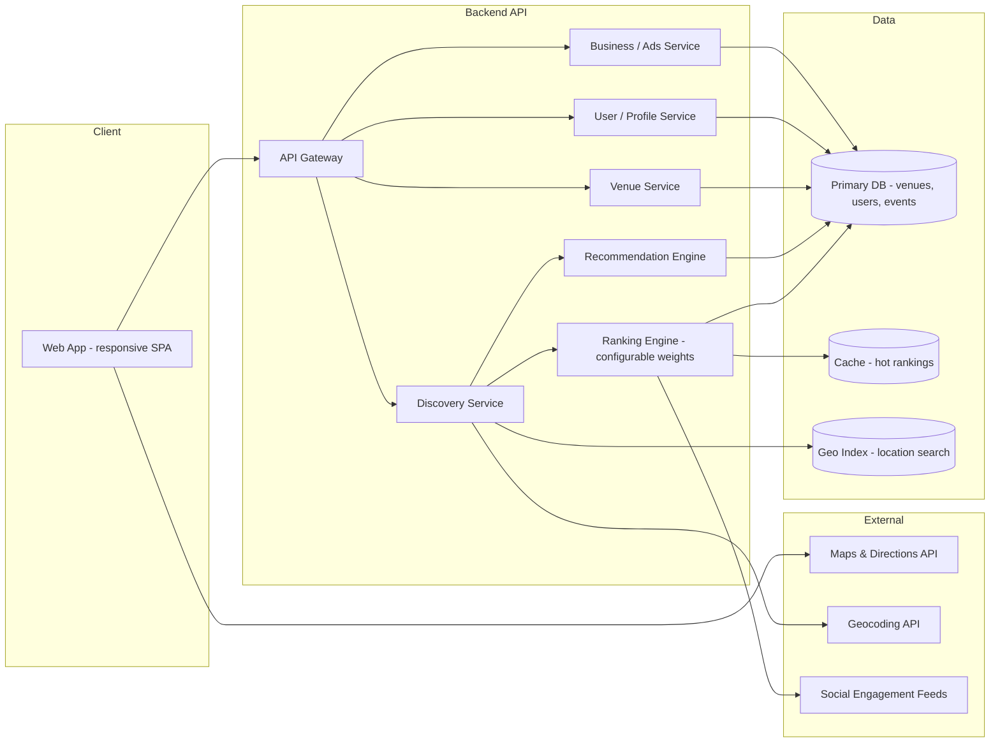
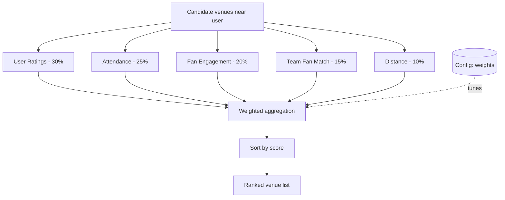
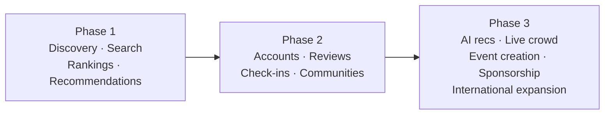

# FanMatch — Workflow & Architecture Diagrams

Reference diagrams for the development team. All diagrams use
[Mermaid](https://mermaid.js.org/) and render natively on GitHub.

---

## 1. User Flow (MVP)

The end-to-end path a fan takes from landing to attending an event.


---

## 2. System Architecture (High Level)



---

## 3. Ranking Engine Pipeline

How a venue score is computed. Weights are configurable without a deploy.



---

## 4. Phased Delivery Roadmap



---

## 5. Data Model (Core Entities)

```mermaid
erDiagram
    USER ||--o{ INTERACTION : has
    USER ||--o{ FAVORITE_TEAM : selects
    VENUE ||--o{ EVENT : hosts
    VENUE ||--o{ REVIEW : receives
    EVENT ||--o{ CHECKIN : records
    TEAM ||--o{ FAVORITE_TEAM : referenced
    EVENT }o--|| MATCH : shows

    USER {
        id PK
        location
        created_at
    }
    VENUE {
        id PK
        name
        address
        geo_point
        capacity
        rating_avg
    }
    EVENT {
        id PK
        venue_id FK
        match_id FK
        start_time
        est_attendance
    }
    TEAM {
        id PK
        name
        country
    }
    MATCH {
        id PK
        competition
        home_team
        away_team
        kickoff
    }
```

> **Note for engineers:** the data model is competition-agnostic (`MATCH` carries
> a `competition` field), so the same schema serves the World Cup launch and
> later leagues (Premier League, UCL, MLS, La Liga) without restructuring.
