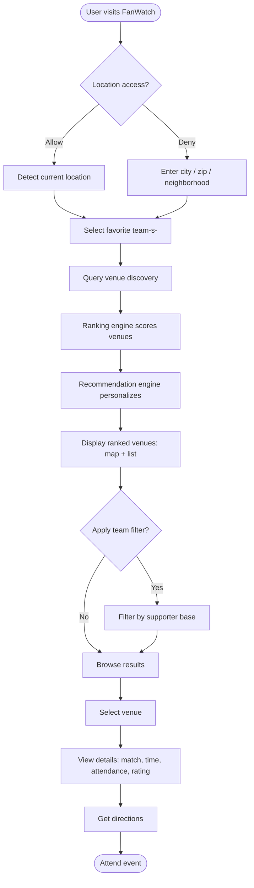
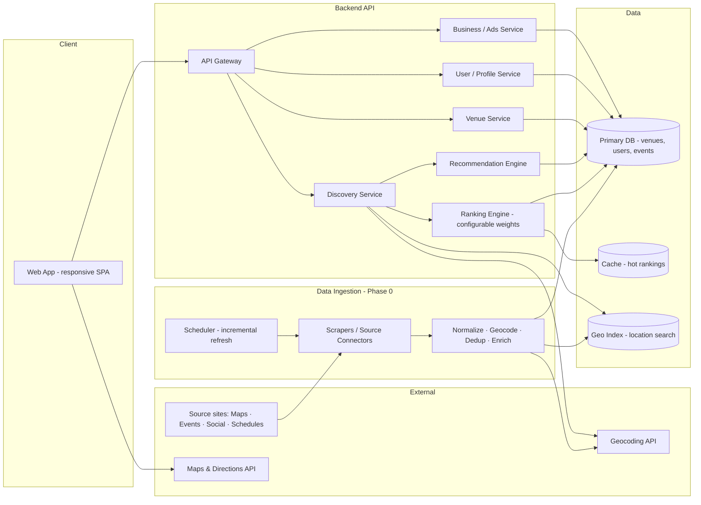
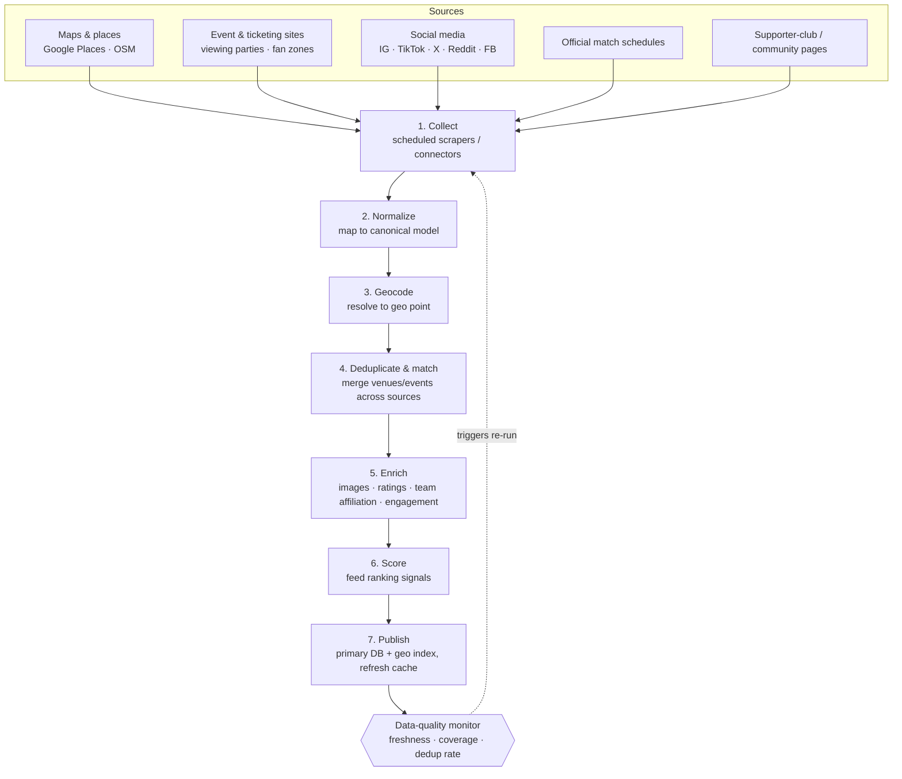
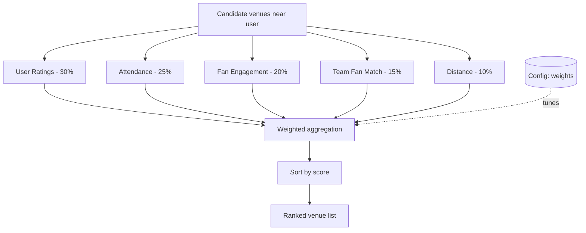
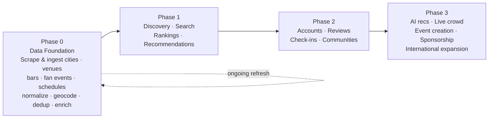

# FanWatch — Workflow & Architecture Diagrams

Reference diagrams for the development team. All diagrams use
[Mermaid](https://mermaid.js.org/) and render natively on GitHub.

---

## 1. User Flow (MVP)

The end-to-end path a fan takes from landing to attending an event.



> The discovery query (step F) reads from the aggregated dataset produced by the
> ingestion pipeline (§3).

---

## 2. System Architecture (High Level)



---

## 3. Data Ingestion / Scraping Pipeline (Phase 0 — Foundation)

How raw, fragmented data becomes the clean dataset that powers discovery. Runs
on a schedule and refreshes incrementally.



**What gets ingested:** cities & locations, venues (bars/pubs/restaurants/fan
parks), fan events (viewing parties, community watch events), match schedules
per competition, and enrichment signals (images, ratings, social engagement,
team affiliation).

---

## 4. Ranking Engine Pipeline

How a venue score is computed. Weights are configurable without a deploy.



---

## 5. Phased Delivery Roadmap



---

## 6. Data Model (Core Entities)

```mermaid
erDiagram
    USER ||--o{ INTERACTION : has
    USER ||--o{ FAVORITE_TEAM : selects
    VENUE ||--o{ EVENT : hosts
    VENUE ||--o{ REVIEW : receives
    EVENT ||--o{ CHECKIN : records
    TEAM ||--o{ FAVORITE_TEAM : referenced
    EVENT }o--|| MATCH : shows
    SOURCE ||--o{ VENUE : provides
    SOURCE ||--o{ EVENT : provides

    USER {
        id PK
        location
        created_at
    }
    VENUE {
        id PK
        name
        address
        geo_point
        capacity
        rating_avg
        source_id FK
    }
    EVENT {
        id PK
        venue_id FK
        match_id FK
        start_time
        est_attendance
        source_id FK
    }
    TEAM {
        id PK
        name
        country
    }
    MATCH {
        id PK
        competition
        home_team
        away_team
        kickoff
    }
    SOURCE {
        id PK
        name
        type
        last_scraped_at
    }
```

> **Notes for engineers:**
> - The model is competition-agnostic (`MATCH.competition`), so the same schema
>   serves the World Cup launch and later leagues (Premier League, UCL, MLS,
>   La Liga) without restructuring.
> - `SOURCE` tracks provenance for every scraped record — required for dedup,
>   freshness checks, and honoring source terms / rate limits.
